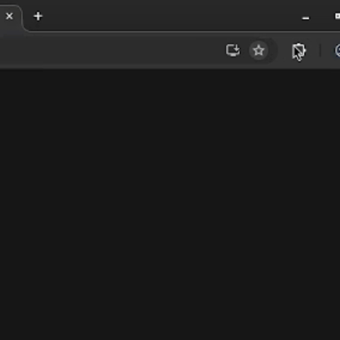

# whatsapp-web-prefixer

O **WhatsApp Web Prefixer** é uma extensão de navegador, baseada no **Manifest V3**, que automatiza a inserção de prefixos personalizáveis no campo de digitação do WhatsApp Web.

## Download

**Download disponível em:**  [whatsapp-web-prefixer v1.0](https://github.com/caa-nm/whatsapp-web-prefixer/releases/tag/Main)

## Contexto e Motivação

Desenvolvida para atender às necessidades internas de comunicação institucional, a extensão não compartilha informações nem coleta dados de telemetria.

Criada para suprir demandas operacionais do **Centro de Agricultura Alternativa do Norte de Minas (CAA-NM)**, a ferramenta facilita a identificação de técnicos e setores em atendimentos e comunicações institucionais. Ao adotar uma solução própria, a instituição fortalece sua autonomia e reduz a dependência de softwares proprietários ou serviços externos.

## Comunidade e Colaboração

O **CAA-NM** mantém o código aberto a contribuições e auditorias, incentivando a colaboração da comunidade e a evolução contínua da solução.

Atenciosamente,  
**Equipe de Informática**

## Contribuidores

- @vnscss
- @luissoaresg
